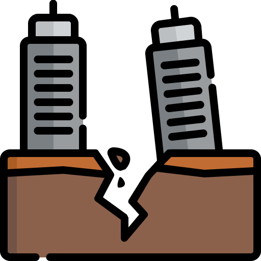

# `fod-vela`

  

**Service watching for [nixpkgs](https://github.com/NixOS/nixpkgs) FOD discrepancies over time**

> In some historical contexts, the term "vela" (from the Spanish verb "velar" meaning "to watch" or "to keep vigil over") has been used in relation to earthquake monitoring.
